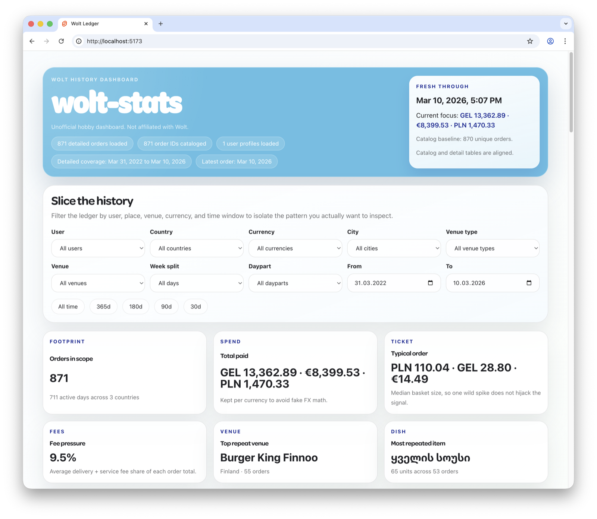
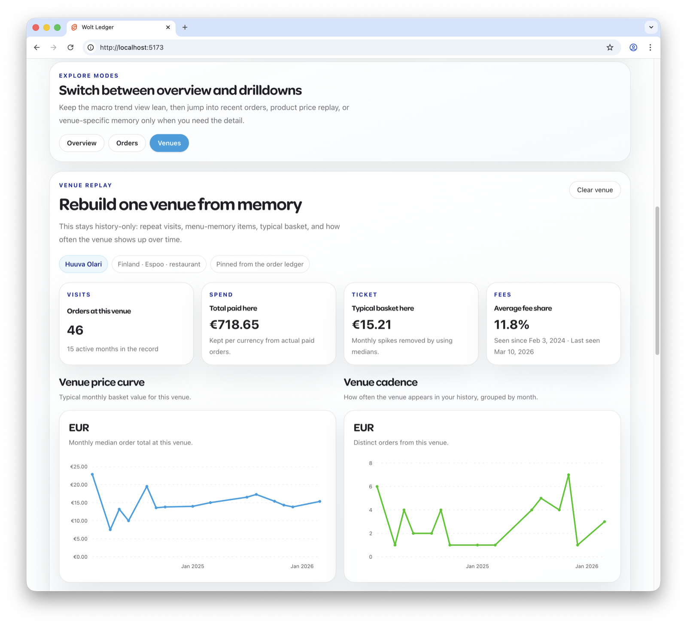

# Stats dashboard (`wolt stats`)

`wolt stats` brings your Wolt order history home. One command downloads the
[wolt-stats](https://github.com/mekedron/wolt-stats) dashboard bundle, syncs
every order Wolt has on file into a local SQLite database, serves the dashboard
at `http://127.0.0.1:5173`, and opens your browser. Nothing leaves your
machine — the dashboard is a static SvelteKit app reading the SQLite file in
the browser via sql.js.



## Quick start

```bash
# First run: download bundle, sync history, open dashboard
wolt stats

# Subsequent runs: incremental — only fetches new orders
wolt stats

# Re-open the dashboard without re-syncing
wolt stats --no-sync

# Force a full re-scan of every order
wolt stats --resync

# Serve without opening a browser (e.g. on a server)
wolt stats --no-open
```

## What it tracks

The sync persists everything Wolt returns from the order-history endpoints:

- Catalog summaries — purchase id, payment timestamp, venue, currency, totals,
  short item summary, status, delivery method, main image.
- Full order details — line items with options, payments (provider, card name,
  credits applied), delivery distance and base price, service fee, discounts,
  gift cards, order adjustment rows, creation/delivery times.

From those rows the dashboard derives spend by month, top venues, item
leaderboards, weekday/hour-of-day patterns, average order size, delivery-fee
breakdowns, and more. The full schema lives in `internal/service/statssync/store.go`.




## Where data lives

```
~/.wolt/stats/
├── bundle/                       # downloaded dashboard release (versioned)
│   └── v0.2.1/                   # extracted SvelteKit static site
└── db/
    └── wolt-history.sqlite       # your sync target — read by the dashboard
```

The directory location is overrideable with `--stats-dir` or `$WOLT_STATS_DIR`.

## Sync model

The catalog phase pages backwards through `/v1/order_history` until it hits an
order that's already in the local DB (incremental mode), then stops. The detail
phase fetches `/v1/order_history/purchase/<id>` for every catalog row that
doesn't yet have a `orders` table entry.

Two phases share a single inter-call pacer:

- Baseline pacing is **1.1 s/call**. Empirically this is at or under Wolt's
  per-token throttle ceiling.
- Each `HTTP 429` response bumps the pacer by **+500 ms** for the remainder of
  the run (capped at +5 s extra), so the sync settles into whatever sustained
  rate your account actually permits.
- Individual 429 retries use exponential backoff (2s → 4s → 8s → …, capped 60s)
  and honor any `Retry-After` header.
- If retries are exhausted on a single order, the run surfaces a resumable
  error pointing at where it stopped. Re-running picks up where it left off.

## Flags

| Flag | Default | Effect |
| --- | --- | --- |
| `--no-sync` | `false` | Skip the order-history sync, serve whatever is already in the local DB. Useful for re-opening the dashboard quickly. |
| `--no-open` | `false` | Don't launch the browser. Pair with `--port` for headless/server use. |
| `--resync` | `false` | Force a full backfill instead of incremental. Use this if the catalog stop heuristics miss an order or if you've deleted/edited rows. |
| `--no-check-updates` | `false` | Skip the GitHub release check. The cached bundle is reused as-is. |
| `--bundle-version` | latest | Pin to a specific [wolt-stats release tag](https://github.com/mekedron/wolt-stats/releases) (for example `v0.2.0`). |
| `--port` | `5173` | Preferred HTTP server port. Auto-picks `+1` if the port is busy. |
| `--stats-dir` | `~/.wolt/stats` | Override the install/data directory. Also reads `$WOLT_STATS_DIR`. |

All global flags (`--format`, `--verbose`, `--locale`, etc.) apply too.

## Privacy

Your order history never leaves your machine. The dashboard is plain static
files served from `127.0.0.1` — no telemetry, no third-party requests, no
analytics. The only network traffic is:

1. wolt-cli → Wolt's consumer API, with your saved access token, to fetch order
   history (same endpoints your browser already calls).
2. wolt-cli → GitHub, once per run, to check for a newer dashboard release
   (suppressible with `--no-check-updates`).

The on-disk SQLite is owner-readable (`0o600`) under `~/.wolt/stats/db/`.

## Implementation notes

- Source for the sync engine: [`internal/service/statssync/`](https://github.com/mekedron/wolt-cli/tree/main/internal/service/statssync).
- Source for the embedded HTTP server: [`internal/service/statsserve/`](https://github.com/mekedron/wolt-cli/tree/main/internal/service/statsserve).
- The bundle is fetched from [wolt-stats releases](https://github.com/mekedron/wolt-stats/releases); pinning is by tag.
- SQLite is opened via [`modernc.org/sqlite`](https://pkg.go.dev/modernc.org/sqlite) (pure-Go, no CGO).
